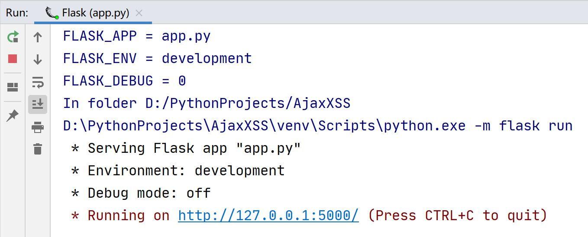
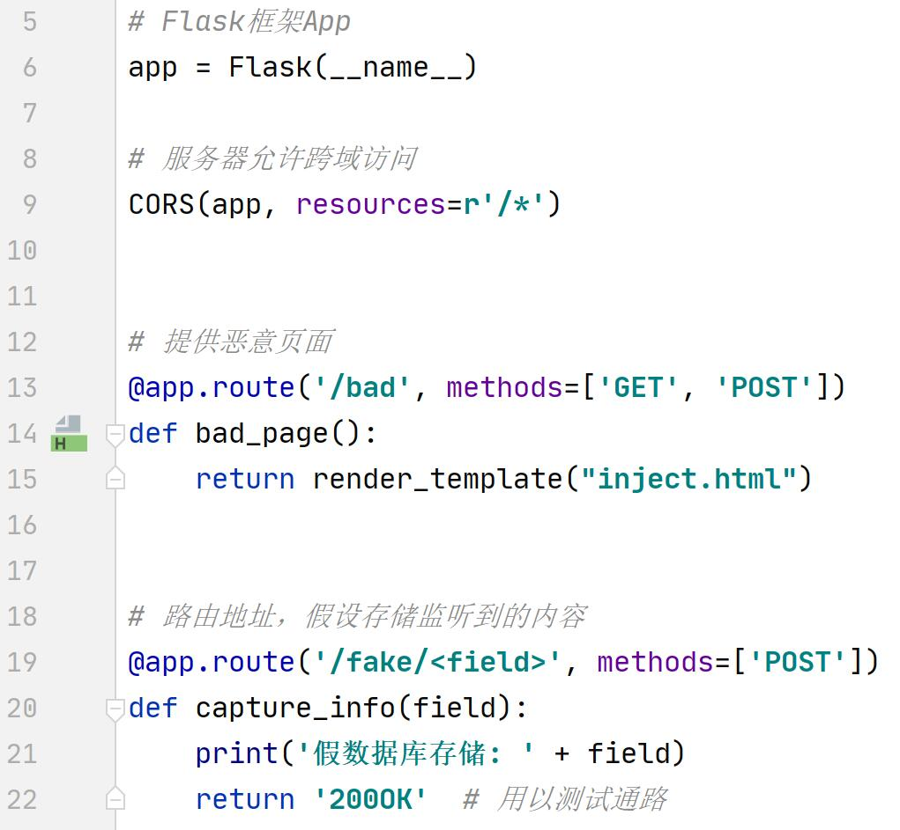
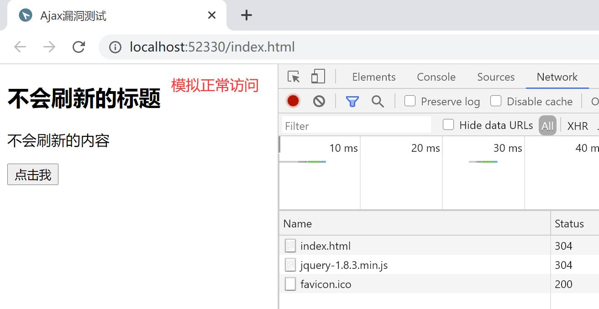
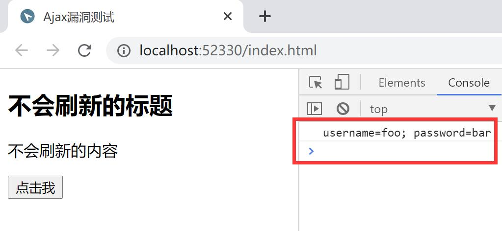
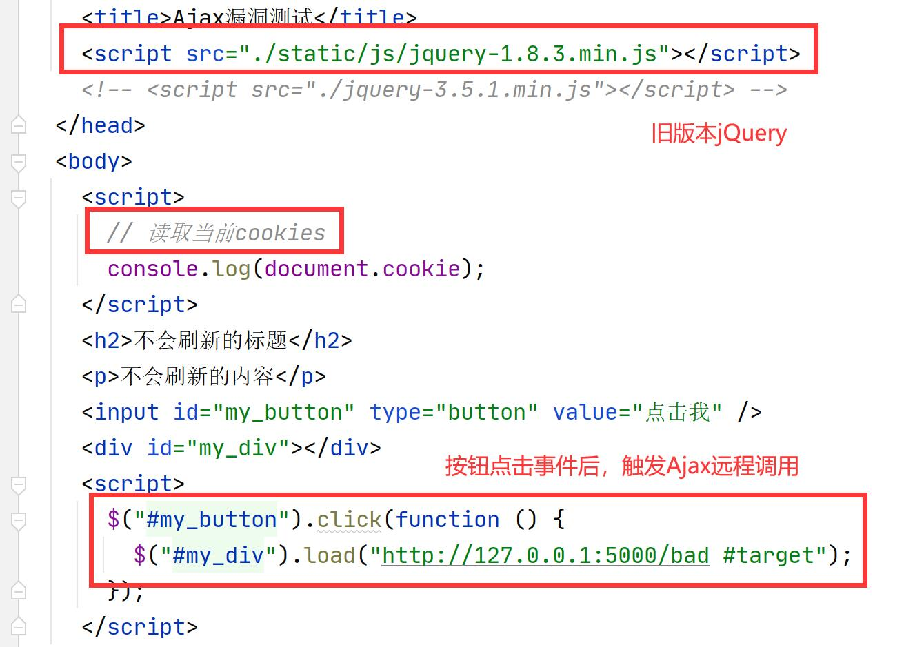
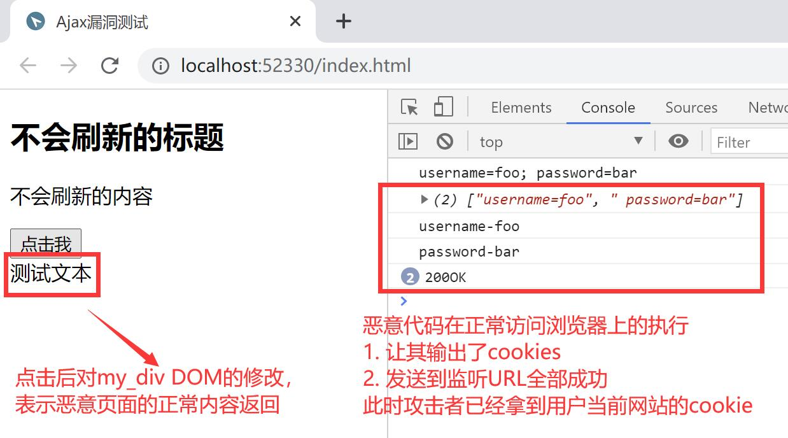
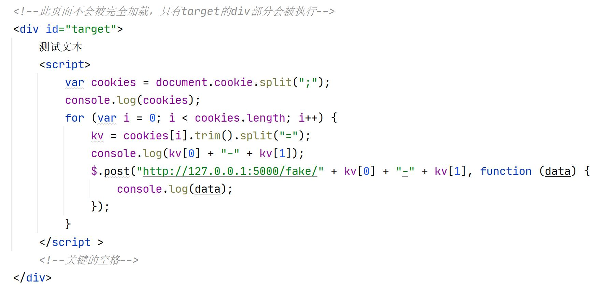
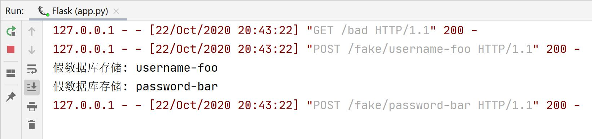

# 通过Ajax漏洞实现XSS攻击

## 项目结构介绍

├─assets 图片
├─static 
│  └─js jquery库
├─templates
│  └─inject.html 包含攻击代码的html文件
├─index.html 用户正常访问的页面
├─app.py Flask框架应用

**注意：**

`index.html`表示正常访问的页面，为了体现浏览器的跨域请求，此文件不通过Flask路由，而是通过VSCode的`Open In Default Browser`插件模拟网页访问

`app.py`文件中设置了监听服务器允许跨域请求，Flask框架是提供恶意网页和监听服务运行的

## 漏洞复现简要介绍

参考[漏洞复现简要介绍](./漏洞复现简要介绍.md)

## 执行过程

1. 首先开启服务监听

对应代码为，相应注释

2. 之后在VSCode打开`index.html`并模拟正常访问

且控制台内容显示当前的**cookies**

对应正常页面的代码

3. 点击按钮，**触发Ajax异步事件**，执行结果

对应恶意代码见`templates/inject.html`

**执行原理**

返回内容也是一段JS代码，而且会被立即执行，执行结果会输出在正常访问用户的控制台内

由于执行者是正常页面所在的浏览器，所以可以访问当前的cookies，进而再通过一次Ajax调用`post()`发送得到的cookie信息给监听服务器URL`http://127.0.0.1:5000/fake/`

查看Flask app运行的控制台

确实对应了一次恶意页面的获取，和两次cookie的`POST`传输

说明攻击成功