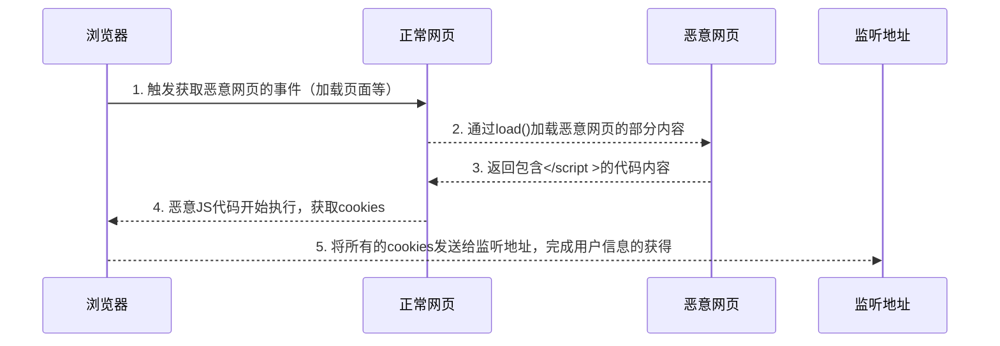

# 漏洞复现简要介绍

## 1. jQuery简要介绍

参考[引用](https://snyk.io/vuln/SNYK-JS-JQUERY-569619)

jQuery是JavaScript使用率非常高的库之一，并且存在着从`1.x`,`2.x`和`3.x`的版本

可以参考[bootCDN](https://www.bootcdn.cn/jquery/)提供了若干版本

jQuery针对HTML文档遍历、操控、更改DOM甚至异步调用(Ajax)更加简单的API

## 2. jQuery中的Ajax漏洞

关于jQuery中Ajax调用方法`load()`，请参考[jQuery Ajax - load()方法](https://www.w3school.com.cn/jquery/ajax_load.asp)，**加载页面片段**部分

jQuery Version < `1.9.0` 的包中，`load()`方法不能识别并移除包含一个空白符号的HTML标签，比如`</script >`，由此可能造成潜在的XSS攻击，尤其是当攻击者对将要被加载的代码部分拥有修改权时

`load()`方法允许我们规定要获取的HTML文件的某个部分。这一点是通过 URL 参数的特殊语法实现的，该URL字符串紧接第一个空格的字符串则是决定所加载内容的 jQuery 选择器

## 3. 一个调用例子

```javascript
    $("#mydiv").load("inject.html #target");
```

上述一行代码是对jQuery框架 `load()` 方法的使用，功能是本页面尝试获取另一个页面 `inject.html` 的 **id** 为 *target* 的内容。

可想而知，另一个页面的内容最好是**完全被信任且安全**，不会造成漏洞攻击的

而如果另一个页面的内容不可信，且被**精心设计**了，我们结合[第2点](#2-jquery中的ajax漏洞)所说的漏洞，我们可以实现一次XSS攻击

## 4. 攻击过程示例

实线部分表示正常用户可以感知到的过程

虚线部分表示



攻击者获得用户cookies后，可以进一步进行CSRF攻击等


